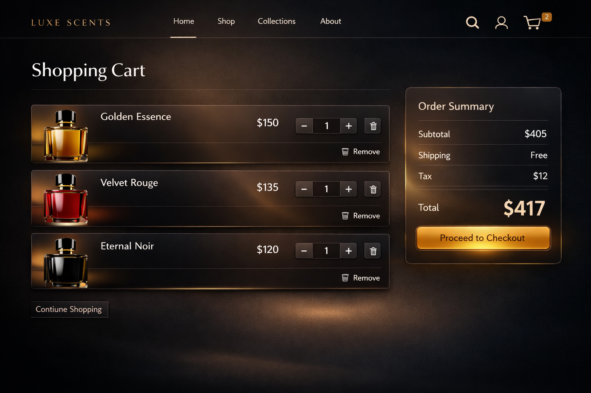
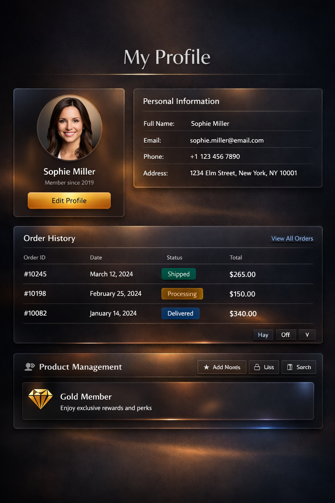
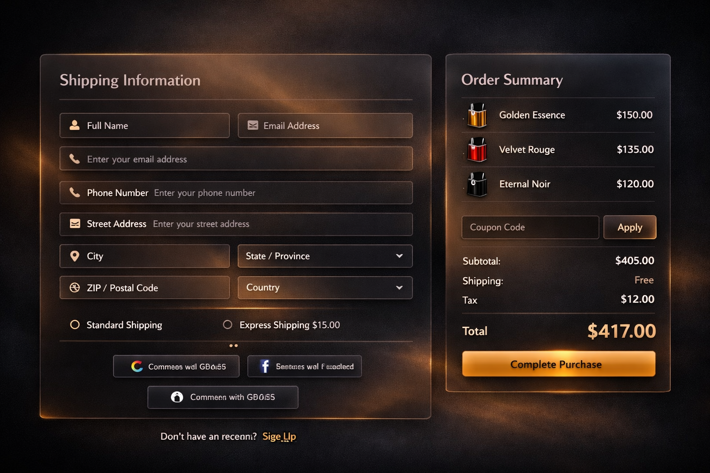
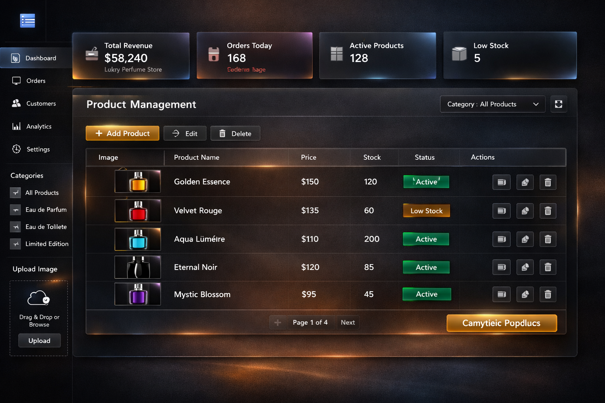
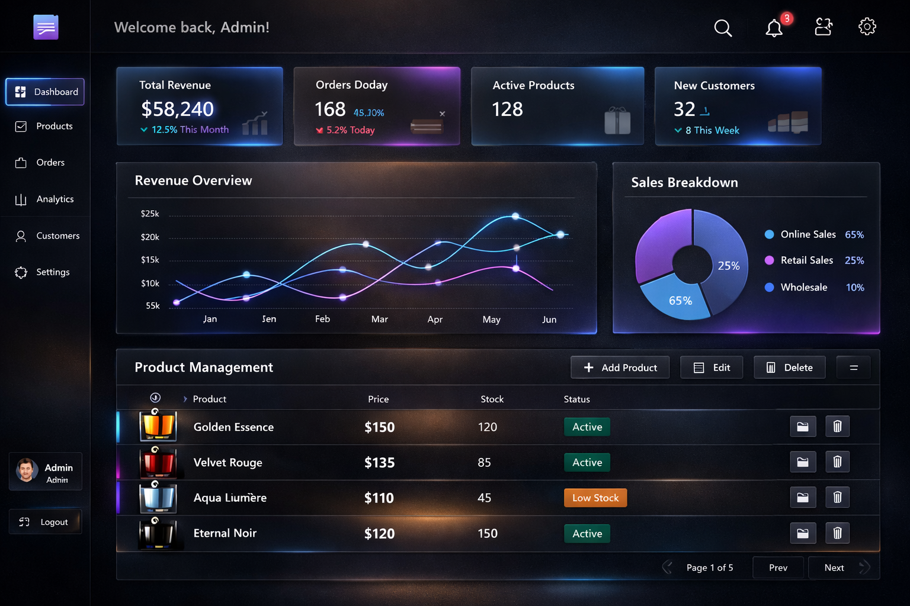

# 🌸 Luxora Perfume Store (Full Stack E-Commerce)

A modern full-stack e-commerce web application built using **Spring Boot + React.js + Redux Toolkit**, showcasing real-world production-level features like authentication, cart system, product management, admin dashboard, and secure APIs.

This project simulates a real-world ecommerce system with full user flow, admin panel, and order management.

## 🚀 Features

### 👤 User Features
- JWT Authentication (Login / Register)
- OAuth2 Login (Google, Facebook, GitHub)
- Browse & search products
- Add / remove items from cart
- Quantity update with live price calculation
- Place orders securely
- View order history
- Password reset via email

### 🛠 Admin Features
- Add / edit / delete products
- Manage users
- View all orders
- Product management dashboard

## 🧠 Tech Stack

**Frontend:** React.js, TypeScript, Redux Toolkit, Ant Design  
**Backend:** Spring Boot, Spring Security, JPA, REST API, GraphQL  
**Database:** PostgreSQL  
**Tools:** Maven, Node.js, Git, GitHub  

## 🏗 Architecture

Frontend (React) → REST/GraphQL APIs → Spring Boot Backend → PostgreSQL Database

## 📸 Screenshots

### 🏠 Home Page

### 📦 Product Page

### 🛒 Cart Page

### 🔐 Login / Register Page

### 👤 User Profile Page

### 📦 Order History Page

### 💳 Checkout Page

### 👨‍💼 Admin Dashboard

### 📊 Analytics Dashboard

## ⚙️ Setup Instructions

### Backend
mvn clean install
mvn spring-boot:run

### Frontend
npm install
npm start

### 🔐 Security Features
JWT Authentication
OAuth2 Social Login
Role-based access control (User/Admin)
Password encryption
Secure REST APIs

### 🚀 Future Improvements
Payment gateway integration (Stripe / Razorpay)
Wishlist feature
Product recommendation system
Docker & AWS deployment
Real-time notifications

### 👨‍💻 Author

Chandrakant Mali
Full Stack Developer | Java | React | Spring Boot